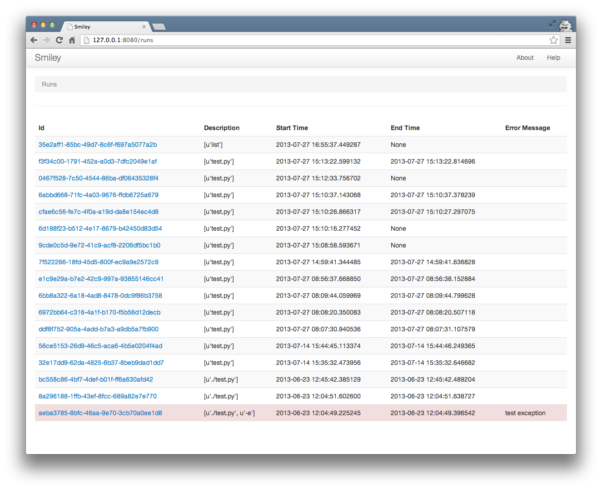
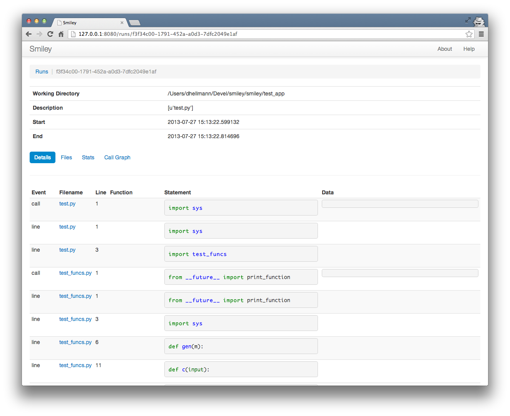
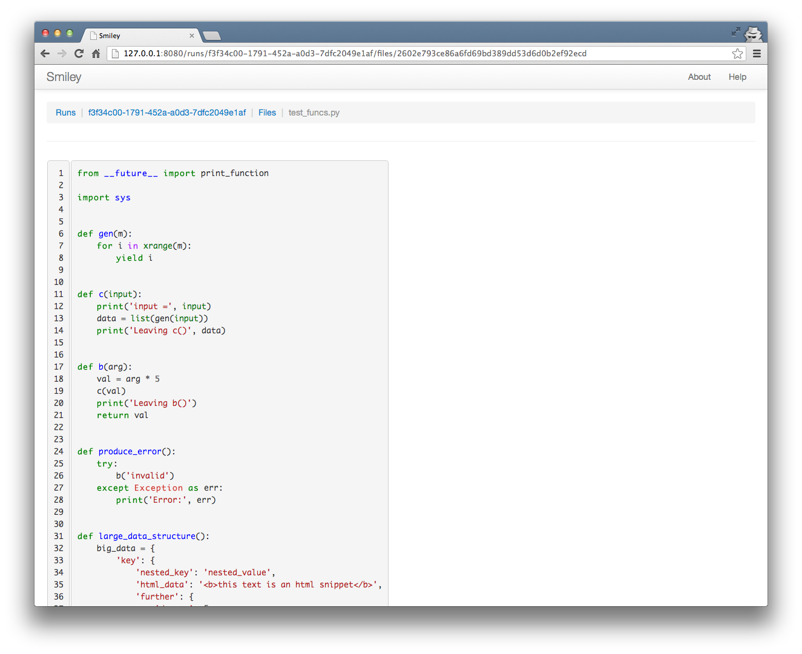
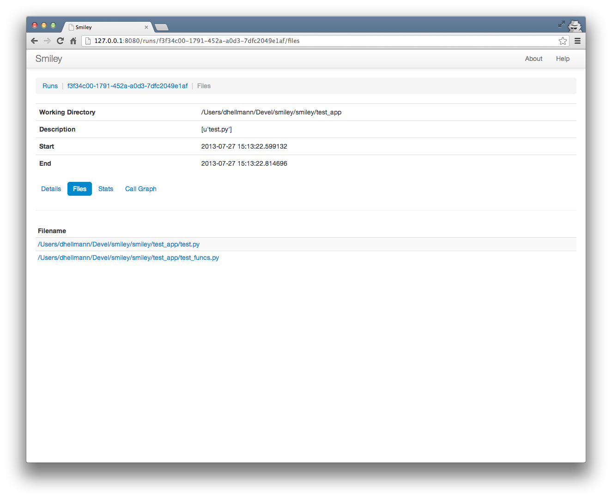
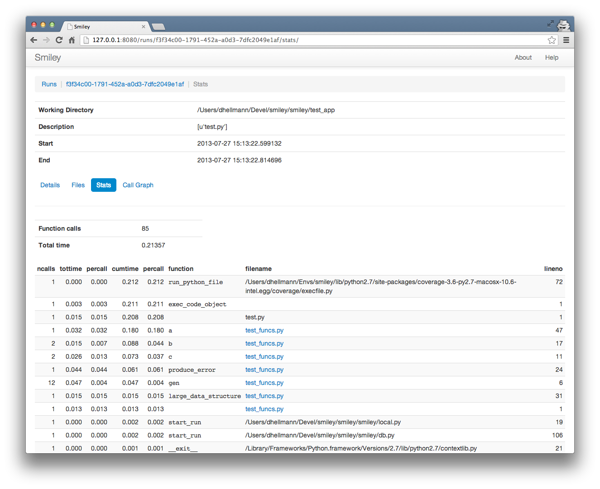
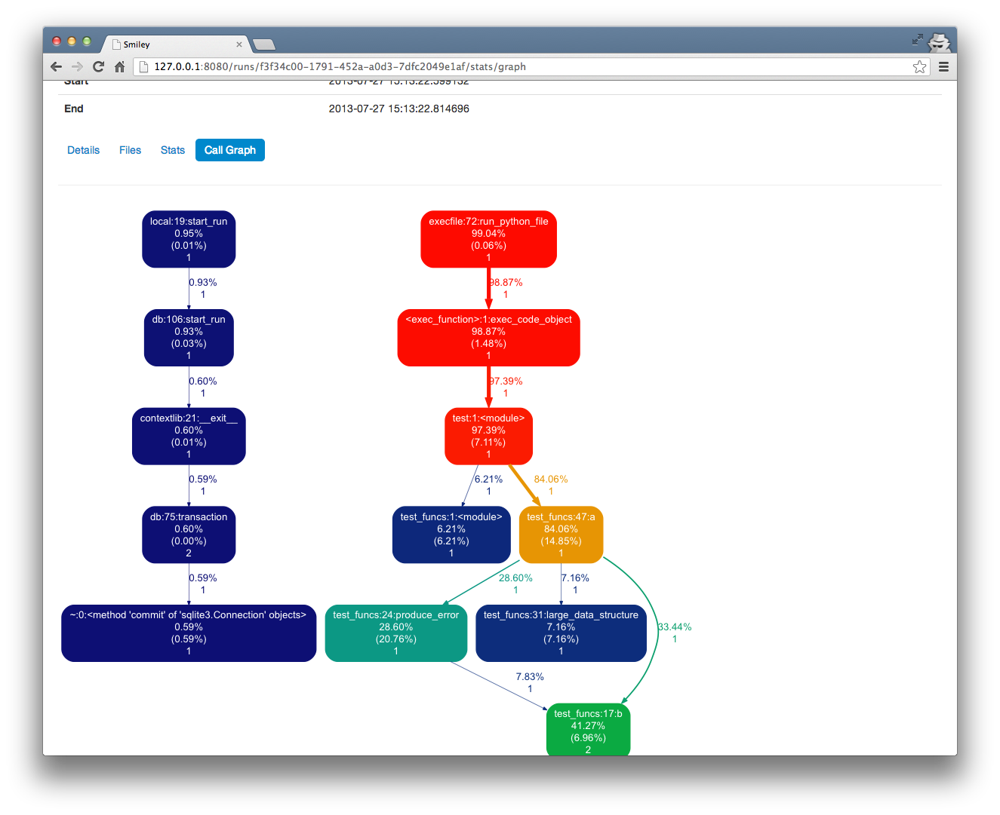

=============
 Server Mode
=============

The :ref:`command-server` command starts a web server on a local port
to provide a user interface for browsing through the run data captured
by :ref:`command-record` and :ref:`command-run`. It connects to the
same database, so as new runs are captured they appear in the user
interface.

Run List
========

The server listens on ``http://127.0.0.1:8080`` by default. Visiting
that page in a browser causes the server to return a list of the runs
found in the database in reverse chronological order. For each run the
list shows its id, "description", start and end times, and any final
error message.

Run Details
===========

Clicking on one of the run id values opens the detailed information
recorded for that run. The details page shows the state of the program
line-by-line as it runs, including where the program control is
(filename, line number, and source line) as well as local variables
and the return values from functions. This is the same information
reported by :ref:`command-monitor` and :ref:`command-replay`, in a
format that is easier to read.

Source Files
============

Each of the filenames in the run details view links to a page showing
the full source of the Python file as it was at the time of the
program's execution.

File List
=========

For an application with many source files, it may be more convenient
to examine the source by navigating to the file list view and choosing
the file from the list.

Profiler Statistics
===================

The stats view shows the profiler output for the run, sorted by
cumulative time. As with the run details, each file name links to the
full source for the module.

Call Graph
==========

The call graph view uses gprof2dot_ and graphviz_ to produce a tree
diagram showing how much time is used in different parts of the
program, to make it easier to focus on the areas that use the most
time.

.. _gprof2dot: https://code.google.com/p/jrfonseca/wiki/Gprof2Dot
.. _graphviz: http://www.graphviz.org/

.. note::

   In order for this page to work, you must have the ``dot`` command
   installed. Installing smiley should install ``gprof2dot``
   automatically.
